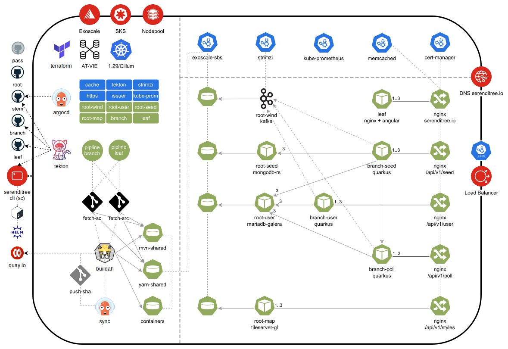

# Serenditree

## About
This is the parent repository and starting point for Serenditree.

## Overview
The abstract painting below is a non-exhaustive overview of the technology stack and shows the high level architecture of 
Serenditree.



## Development

### Environment
In the following steps `$_ST_HOME` refers to the root folder containing all submodules. If you clone into a folder
called `Serenditree` you will get the following structure:

```
Serenditree/
├── .git
├── .gitmodules
├── README.md
├── assets
├── branch
├── leaf
└── stem
```

The source is structured as follows:
- **[stem](https://github.com/serenditree/stem)**: Command-line interface for development and operations. Setting up clusters, 
  building images and running containers for databases, messaging and map services is done here.
- **[branch](https://github.com/serenditree/branch)**: The Java EE backend.
- **[leaf](https://github.com/serenditree/leaf)**: The Angular frontend.

Serenditree includes a command-line interface (sc) at `$_ST_HOME/stem/cli.sh`. For convenience, you should add an 
alias to your `~/.bashrc`. Otherwise, you have to replace `sc` with `$_ST_HOME/stem/cli.sh` whenever you see it!

```sh
# Alias creation
echo "alias sc='bash $_ST_HOME/stem/cli.sh'" >> ~/.bashrc
source ~/.bashrc
```

### Get the source
```sh
git clone \
    --recurse-submodules \
    --remote-submodules \
    git@github.com:serenditree/root.git \
    $_ST_HOME
sc git -- checkout dev
sc git -- pull --ff-only
```

### Install tools
For initial image building and running the local development stack you will need the following:
```sh
sudo dnf install -y podman buildah git jq
```
For cluster-{installation,images,interaction} you will need:
```sh
sudo dnf install -y tkn skopeo jq pass
```
For the complete set of actions you would need:
```
argbash argocd buildah cilium crc exo git helm jq kubectl oc openshift-install pass podman skopeo terraform tkn xxd yarnpkg
```

Your `pass` password store needs the following items:
```
> pass serenditree
serenditree
├── argocd
├── contact
├── crc.testing
├── data.url
├── github.com
├── json.web.key
├── oidc
│   ├── at.id
│   ├── at.secret
│   ├── at.url
│   ├── de.id
│   ├── de.secret
│   └── de.url
├── quay.io
├── root.seed
├── root.seed.root
├── root.user
└── root.user.root
```

### Before building
- Run `sc status -a`! It will check for issues in your environment. 
- Make sure a local maven repository exists! (``mkdir -p ~/.m2/repository``)

