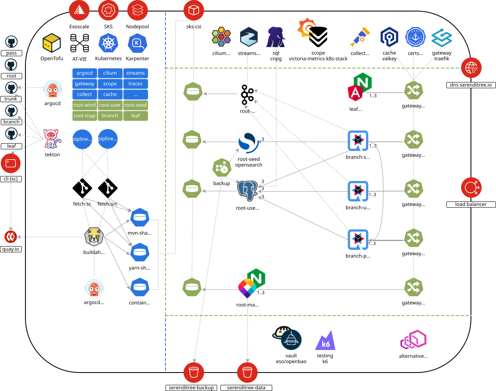

# Serenditree


## About
This is the parent or root repository and starting point for Serenditree.

## Table of Contents

- [Overview](#overview)
- [Development](#development)
  - [Environment](#environment)
  - [Get the source](#get-the-source)
  - [Install tools](#install-tools)
  - [Before building](#before-building)

## Overview
The abstract drawing below is a non-exhaustive overview of the technology stack and shows the high level architecture of 
Serenditree.



## Development

### Environment
In the following steps `$_ST_HOME` refers to the root folder containing all submodules. If you clone into a folder
called `Serenditree` you will get the following structure:

```
Serenditree/
├── .git
├── .gitmodules
├── README.md
├── assets
├── branch
├── leaf
└── trunk
```

The source is structured as follows:
- **[trunk](https://github.com/serenditree/trunk)**: Command-line interface, GitOps, and IaC.
- **[branch](https://github.com/serenditree/branch)**: The Quarkus backend.
- **[leaf](https://github.com/serenditree/leaf)**: The Angular frontend.

Serenditree includes a command-line interface (sc) at `$_ST_HOME/trunk/cli.sh`. For convenience, you should link it to 
a directory that is included in your `$PATH`!

```sh
# Symbolic link creation
ln -s ${_ST_HOME}/trunk/cli.sh ~/.local/bin/sc && sc help
```

### Get the source
```sh
git clone \
    --recurse-submodules \
    --remote-submodules \
    git@github.com:serenditree/root.git \
    $_ST_HOME
ln -s ${_ST_HOME}/trunk/cli.sh ~/.local/bin/sc
sc git -- checkout dev
sc git -- pull --ff-only
```

### Install tools
For image-building and running the local development stack you will need the following:
```sh
sudo dnf install -y podman buildah git jq yq
```
For tasks related to remote clusters you will need:
```sh
sudo dnf install -y helm kubectl tofu skopeo pass
sc update tools -y argocd exo tkn
```

Your `pass` password store needs the following items:
```
> pass serenditree
├── app
│   ├── branch.jwk.encryption
│   ├── branch.jwk.encryption.retiring
│   ├── branch.jwk.signature
│   ├── branch.jwk.signature.retiring
│   ├── rootUser.db.password
│   ├── rootUser.db.user
│   ├── rootUser.root.password
│   └── terraCerts.email
├── cicd
│   ├── terraArgocd.password
│   ├── terraTekton.basic.github
│   ├── terraTekton.basic.quay
│   ├── terraTekton.basic.redhat
│   ├── terraTekton.oauth.quay
│   ├── terraTekton.webhook.listener
│   └── terraTekton.webhook.slack
├── ext
│   ├── ghcr.io
│   ├── github.com
│   ├── openshift.com
│   ├── quay.io
│   ├── redhat.io
│   └── robot.quay.io
├── iam
│   ├── backup-seed.access
│   ├── backup-seed.secret
│   ├── backup-user.access
│   ├── backup-user.secret
│   ├── data.access
│   ├── data.secret
│   ├── scaler.access
│   ├── scaler.secret
│   ├── serenditree.access
│   └── serenditree.secret
├── o11y
│   ├── terraScope.password
│   └── terraScope.webhook
├── oidc
│   ├── at.id
│   ├── at.secret
│   ├── at.url
│   ├── de.id
│   ├── de.secret
│   └── de.url
└── vault
```

### Before building
Run `sc status`! It will check for issues in your environment.
